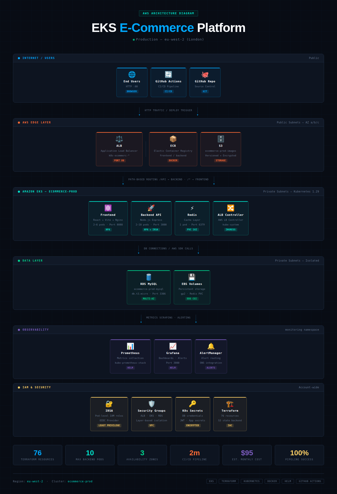

# 🛒 Multi-Tier E-Commerce Platform on Amazon EKS

[](https://github.com/bennymaliti/ecommerce-eks/actions)
[](https://www.terraform.io/)
[](https://kubernetes.io/)
[](https://aws.amazon.com/)
[](https://store.bennymaliti.co.uk)

A production-grade, highly available multi-tier e-commerce platform running on Amazon EKS. Demonstrates end-to-end cloud infrastructure skills including IaC, container orchestration, autoscaling, observability, CI/CD, and HTTPS with custom domain.

🌐 **Live at: [https://store.bennymaliti.co.uk](https://store.bennymaliti.co.uk)**

---

## 📐 Architecture Overview

```
                          ┌──────────────────────────────────────────────────────────┐
                          │                    AWS Cloud (eu-west-2)                 │
                          │                                                           │
  Users ──► Route 53 ──► │  ACM (HTTPS) ──► ALB (AWS Load Balancer Controller)     │
  store.bennymaliti.co.uk │                          │                               │
                          │         ┌────────────────┴────────────────┐             │
                          │         │          EKS Cluster             │             │
                          │         │  ┌──────────┐  ┌──────────┐    │             │
                          │         │  │ Frontend │  │ Frontend │    │             │
                          │         │  │  Pod(s)  │  │  Pod(s)  │    │             │
                          │         │  │  (Nginx) │  │  (Nginx) │    │             │
                          │         │  └────┬─────┘  └────┬─────┘    │             │
                          │         │       └──────┬───────┘          │             │
                          │         │         ┌────▼─────┐            │             │
                          │         │         │ Backend  │            │             │
                          │         │         │ API Pods │◄────────── HPA           │
                          │         │         │(Node.js) │            │             │
                          │         │         └────┬─────┘            │             │
                          │         │    ┌─────────┴──────────┐       │             │
                          │         │    │                     │       │             │
                          │         │  ┌─▼──────┐    ┌───────▼─┐     │             │
                          │         │  │ Redis  │    │Prometheus│     │             │
                          │         │  │ Cache  │    │ Grafana  │     │             │
                          │         │  └────────┘    └─────────┘     │             │
                          │         └─────────────────────────────────┘             │
                          │                    │             │                       │
                          │         ┌──────────▼──┐   ┌─────▼────┐                │
                          │         │ RDS MySQL   │   │    S3    │                │
                          │         │ Multi-AZ    │   │  Bucket  │                │
                          │         │(Private Sub)│   │ (Images) │                │
                          │         └─────────────┘   └──────────┘                │
                          └──────────────────────────────────────────────────────────┘

  VPC: 3 Public Subnets + 3 Private Subnets across 3 AZs (eu-west-2a/b/c)
```

### Visual Architecture Diagram



---

## 🧱 Component Summary

| Layer | Technology | Purpose |
|-------|-----------|---------|
| DNS | Route 53 | Custom domain — store.bennymaliti.co.uk |
| TLS | AWS ACM | HTTPS certificate with DNS validation |
| Ingress | AWS ALB Controller | L7 load balancing, HTTP→HTTPS redirect |
| Frontend | React + Nginx (container) | Product UI served via Nginx |
| Backend API | Node.js REST API (container) | Business logic, auth, orders |
| Cache | Redis (in-cluster) | Session store, product cache |
| Database | Amazon RDS MySQL 8.0 (Multi-AZ) | Persistent transactional data |
| Storage | Amazon S3 | Product images, static assets |
| IaC | Terraform | All 79 AWS resources |
| Orchestration | Amazon EKS (Kubernetes 1.29) | Container scheduling |
| Autoscaling | HPA (CPU + Memory) | Dynamic pod scaling |
| Monitoring | Prometheus + Grafana (Helm) | Metrics and dashboards |
| CI/CD | GitHub Actions | 3-stage build, push, deploy pipeline |
| Registry | Amazon ECR | Docker image storage |
| Security | IRSA | Least-privilege IAM for pods |

---

## 📁 Repository Structure

```
ecommerce-eks/
├── terraform/
│   ├── main.tf                 # Provider config, SG rules
│   ├── vpc.tf                  # VPC, subnets, route tables, NAT gateways
│   ├── eks.tf                  # EKS cluster and managed node groups
│   ├── rds.tf                  # RDS MySQL Multi-AZ
│   ├── s3.tf                   # S3 bucket and policies
│   ├── iam.tf                  # IAM roles (IRSA, nodes, CI/CD user)
│   ├── dns.tf                  # ACM certificate + Route53 DNS validation
│   ├── variables.tf            # Input variables
│   ├── outputs.tf              # Exported values
│   └── terraform.tfvars.example
├── kubernetes/
│   ├── namespace.yaml
│   ├── frontend/               # Deployment, Service, HPA
│   ├── backend/                # Deployment, Service, HPA, ConfigMap
│   ├── redis/                  # Deployment, Service
│   └── ingress/                # ALB Ingress (HTTPS) + Route53 update script
├── apps/
│   ├── frontend/               # React + multi-stage Nginx Dockerfile
│   └── backend/                # Node.js API + Dockerfile
├── monitoring/
│   └── prometheus/values.yaml  # Helm chart overrides
├── .github/workflows/
│   └── deploy.yml              # CI/CD pipeline
└── docs/
    └── architecture-diagram.png
```

---

## 🚀 Prerequisites

| Tool | Version |
|------|---------|
| AWS CLI | ≥ 2.x |
| Terraform | ≥ 1.6 |
| kubectl | ≥ 1.28 |
| Helm | ≥ 3.12 |
| Docker | ≥ 24.x |

---

## 🛠️ Deployment Guide

### Step 1: Configure AWS

```bash
aws configure  # Region: eu-west-2
aws sts get-caller-identity
```

### Step 2: Clone & Configure

```bash
git clone https://github.com/bennymaliti/ecommerce-eks.git
cd ecommerce-eks
cp terraform/terraform.tfvars.example terraform/terraform.tfvars
# Edit db_password, alert_email, root_domain, subdomain
```

### Step 3: Provision Infrastructure (~20 minutes)

```bash
cd terraform
terraform init
terraform apply
# Creates 79 resources: EKS, RDS Multi-AZ, ACM cert, Route53, VPC, ECR, IAM/IRSA
```

### Step 4: Configure kubectl

```bash
aws eks update-kubeconfig --region eu-west-2 --name ecommerce-prod
kubectl get nodes  # Expect 3 nodes Ready
```

### Step 5: Install ALB Controller

```bash
helm repo add eks https://aws.github.io/eks-charts && helm repo update

helm install aws-load-balancer-controller eks/aws-load-balancer-controller \
  -n kube-system \
  --set clusterName=ecommerce-prod \
  --set serviceAccount.create=true \
  --set serviceAccount.annotations."eks\.amazonaws\.com/role-arn"=$(terraform output -raw lb_controller_role_arn) \
  --set region=eu-west-2 \
  --set vpcId=$(terraform output -raw vpc_id)
```

### Step 6: Create Kubernetes Secrets

```bash
RDS_HOST=$(cd terraform && terraform output -raw rds_endpoint | cut -d':' -f1)

kubectl create secret generic db-credentials -n ecommerce \
  --from-literal=host=$RDS_HOST \
  --from-literal=username=admin \
  --from-literal=password=YourPassword \
  --from-literal=port=3306 \
  --from-literal=database=ecommerce

kubectl create secret generic app-secrets -n ecommerce \
  --from-literal=jwt_secret=$(openssl rand -base64 32)
```

### Step 7: Update & Apply Ingress

Update `kubernetes/ingress/ingress.yaml` with your subnet IDs, ALB SG ID, and ACM cert ARN from Terraform outputs, then:

```bash
kubectl apply -f kubernetes/namespace.yaml
kubectl apply -f kubernetes/redis/
kubectl apply -f kubernetes/backend/
kubectl apply -f kubernetes/frontend/
kubectl apply -f kubernetes/ingress/
```

### Step 8: Create Route53 A Record

```bash
# Wait ~3 minutes for ALB to provision, then:
bash kubernetes/ingress/update-route53.sh
# Site is live at https://store.bennymaliti.co.uk
```

### Step 9: Install Monitoring

```bash
helm repo add prometheus-community https://prometheus-community.github.io/helm-charts
helm repo update
helm install monitoring prometheus-community/kube-prometheus-stack \
  -n monitoring --create-namespace \
  -f monitoring/prometheus/values.yaml

# Access Grafana
kubectl port-forward -n monitoring svc/monitoring-grafana 3000:80
```

---

## 🔄 CI/CD Pipeline

Push to `main` triggers the 3-stage pipeline automatically:

```
┌──────────┐     ┌─────────────────┐     ┌────────────────────┐
│   Test   │────►│  Build & Push   │────►│   Deploy to EKS    │
│  (Jest)  │     │ to ECR (by SHA) │     │  Rolling update    │
└──────────┘     └─────────────────┘     └────────────────────┘
```

**Required GitHub Secrets:**
```
AWS_ACCESS_KEY_ID, AWS_SECRET_ACCESS_KEY
AWS_REGION=eu-west-2, EKS_CLUSTER_NAME=ecommerce-prod, ECR_REGISTRY
```

---

## ⚖️ Autoscaling

| Component | Min | Max | Trigger |
|-----------|-----|-----|---------|
| Backend pods | 2 | 10 | CPU > 70%, Memory > 80% |
| Frontend pods | 2 | 6 | CPU > 60% |
| EKS nodes | 2 | 6 | Pending pods |

---

## 💰 Estimated Cost (~$315/month)

| Resource | Cost/Month |
|----------|-----------|
| EKS Cluster | $73 |
| EC2 Nodes (3× t3.medium) | $90 |
| NAT Gateways (3×) | $100 |
| RDS MySQL Multi-AZ | $30 |
| ALB | $20 |
| Route53 | $0.50 |
| ECR + S3 | ~$2 |

> 💡 Tear down after demos: `terraform destroy` — rebuilds in ~20 minutes.

---

## 🧹 Tear Down

```bash
kubectl delete namespace ecommerce monitoring
helm uninstall aws-load-balancer-controller -n kube-system

# Force-delete ECR images
aws ecr batch-delete-image --region eu-west-2 --repository-name ecommerce-frontend \
  --image-ids "$(aws ecr list-images --region eu-west-2 --repository-name ecommerce-frontend --query 'imageIds[*]' --output json)"
aws ecr batch-delete-image --region eu-west-2 --repository-name ecommerce-backend \
  --image-ids "$(aws ecr list-images --region eu-west-2 --repository-name ecommerce-backend --query 'imageIds[*]' --output json)"

# Disable RDS deletion protection
aws rds modify-db-instance --region eu-west-2 \
  --db-instance-identifier ecommerce-prod-mysql \
  --no-deletion-protection --apply-immediately

cd terraform && terraform destroy
```

---

## 🔧 Common Issues

| Issue | Fix |
|-------|-----|
| ALB not provisioning | Add `elasticloadbalancing:DescribeListenerAttributes` to lb-controller IAM role |
| 504 Gateway Timeout | Add ALB SG inbound rules (ports 3000, 8080) to EKS cluster SG |
| Backend `CreateContainerConfigError` | Create `db-credentials` and `app-secrets` K8s secrets |
| RDS `ETIMEDOUT` | Add EKS cluster SG to RDS inbound rules on port 3306 |
| ECR delete fails | Use `--force` or `batch-delete-image` first |

---

## 🙋 Author

**Benny Maliti** — Cloud Engineer portfolio project demonstrating production-level AWS + Kubernetes expertise.

🔗 [linkedin.com/in/bennymaliti](https://linkedin.com/in/bennymaliti) · [github.com/bennymaliti](https://github.com/bennymaliti) · [store.bennymaliti.co.uk](https://store.bennymaliti.co.uk)

**Skills demonstrated:** Terraform IaC · Amazon EKS · Kubernetes · Helm · Docker · IRSA · ACM/HTTPS · Route53 · RDS Multi-AZ · Prometheus · Grafana · GitHub Actions CI/CD · AWS ALB Controller
